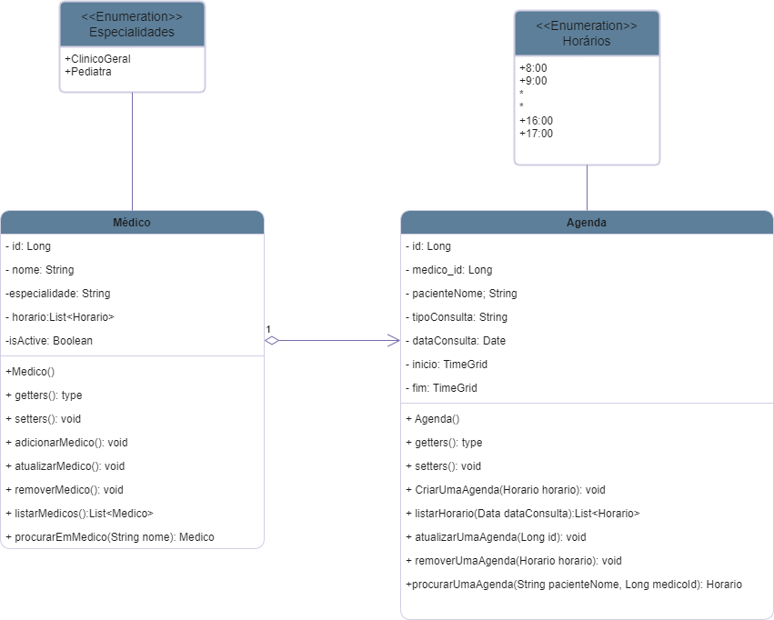

# AGENDA

Projeto desenvolvido como avaliação final do módulo de Spring Boot do curso +Dev2Blu 2023. A Agenda é um BackEnd de uma aplicação
para consulório médico que permite cadastre e gerencie a agenda de consultas dos paciente.

# Diagrama de Classes

   

# Requisitos Funcionais

Médicos
- Cadastramento de médicos.
- Exclusão de um cadastro de médicos.
- Atualizar o cadastro de um médicos.
- Listar médicos cadastrados.
- Pesquisar um cadastro de médicos pelo nome do mesmo.

Agenda
- Cadastramento de horários.
- Exclusão de um horário.
- Atualizar um horário
- Listar horários cadastrados.
- Pesquisar um horário pelo nome paciente agendado.

# Requisitos Não Funcionais
- Desenvolvido em Java.
- Spring Boot Framework.
- Cobertura mínima de código de 50%(testes unitários).
- Banco de Dados em Postgres.
- Documentação das API’s no Swagger.
- Maven para gerenciamento das dependências do projeto.
- Flyway para gerenciamento dos migrations do projeto.
- Deploy da aplicação no Railway.

# Regras de Negócio

- A aplicação deve permitir o agendamento de um horário para todo o ano das 8 às 17 horas.
- A aplicação deve listar os horários agendados e disponíveis do dia selecionado de seu respectivo dos médicos.

  # Documentação
- Arquivo Swagger-Doc.JSON disponível em resources/static.
- Arquivo do Insomnia para testar os endpoints da aplicação em localhost disponível em Documentation/Insomnia_Endpoints_localhost.json
- Arquivo do Insomnia para testar os endpoints da aplicação em produdução disponível em Documentation/Insomnia_Endpoints_Railway_Prodution.json

- # Agradecimentos
- Professor Marcio Michelluzzi
- Jhonny Azevedo
- Eduardo Orthmann
- Clovis Pilger Junior
- Tiago Martins Speckart
